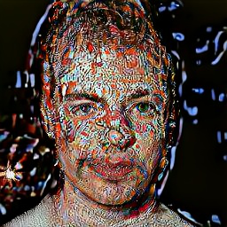
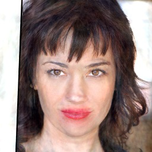
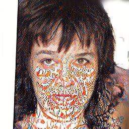

# D2C: Diffuison-Decoding Models for Few-shot Conditional Generation

[**Project**](https://d2c-model.github.io/) | [**Paper**](https://arxiv.org/abs/2106.06819) | [**Colab**]()

PyTorch implementation of **D2C: Diffuison-Decoding Models for Few-shot Conditional Generation**.

[Abhishek Sinha*](https://a7b23.github.io/), [Jiaming Song](https://tsong.me/), [Chenlin Meng](https://cs.stanford.edu/~chenlin/), [Stefano Ermon](https://cs.stanford.edu/~ermon/)


## Overview


<table>
<thead>
<tr>
  <th onclick="sorting(tbody, 0)">Attribute</th>
  <th onclick="sorting(tbody, 1)" width="17%">Original</th>
  <th onclick="sorting(tbody, 2)" width="17%">D2C</th>
  <th onclick="sorting(tbody, 3)" width="17%">StyleGAN2</th>
  <th onclick="sorting(tbody, 4)" width="17%">NVAE</th>
  <th onclick="sorting(tbody, 5)" width="17%">DDIM</th>
</tr>

</thead>
<tbody>
  <tr>
  <td>Blond</td>
 <td></td>
 <td></td>
 <td></td>
 <td></td>
 <td></td>
</tr>
  <tr>
  <td>Red Lipstick</td>
 <td></td>
 <td></td>
 <td></td>
 <td></td>
 <td></td>
</tr>
<tr>
<td>Beard</td>
 <td></td>
 <td></td>
 <td></td>
 <td></td>
 <td></td>
</tr>
</tr>
</tbody>
</table>

## Getting started
The code has been tested on PyTorch 1.9.1 (CUDA 10.2).

To use the checkpoints, download the checkpoints from [this link](https://drive.google.com/drive/folders/1rbztSCF27azt64M2d3dsL38ZDZ489Rsn?usp=sharing), under the `checkpoints/` directory.
```[bash]
# Requires gdown >= 4.2.0, install with pip
gdown https://drive.google.com/drive/u/1/folders/1DvApt-uO3uMRhFM3eIqPJH-HkiEZC1Ru -O checkpoints/ --folder
```

## Examples 
The `main.py` file provides some basic scripts to perform inference on the checkpoints. 

Example to perform image manipulation:
```
python main.py celeba_256 manipulation --d2c_path checkpoints/ffhq_32/model.ckpt --boundary_path checkpoints/ffhq_32/red_lipstick.ckpt --image_dir images/red_lipstick
```

Example to perform unconditional image generation:
```
python main.py celeba_256 sample_uncond --d2c_path checkpoints/ffhq_32/model.ckpt --skip 100 --save_location results/uncond_samples
```
